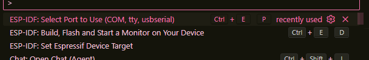
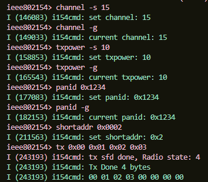
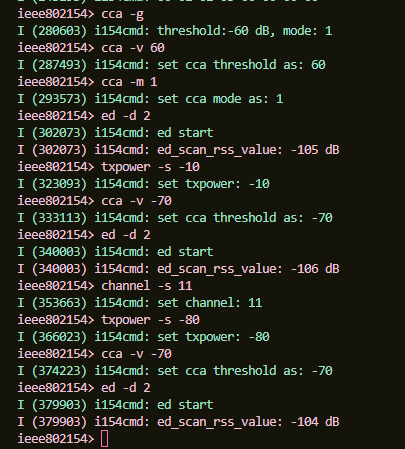

| Supported Targets | ESP32-C5 | ESP32-C6 | ESP32-H2 |
| ----------------- | -------- | -------- | -------- |

# IoT Application: IEEE802.15.4 Command Line Example

**Course:**  Desarrollo de Sistemas IoT (IoT systems development)  

**University:**  National University of Colombia  

---

This repo demonstrates an IEEE802.15.4 Command Line. The IEEE802.15.4 CLI exposes configuration and management APIs via a command line interface.

For the example is required a base code created by the official Espressif website. To obtain it we execute the following steps:

1. Press `Ctrl + Shift + P` to open command palette.
2. Search and execute `ESP-IDF: Show Examples` selecting ESP-IDF version.
3. Select `ìeee802154/ieee802154_cli` (IEEE802.15.4 Command Line Example).
4. Select folder to create project

## Requirements
- ESP32-C6-DevKitC-1 v1.2 connected to port CH343 via USB.
- Previously base code downloaded.

## Application
The example include default functions useful for IEEE 802.15.4 so, is not necessary make changes on the code. Then, we configure the target, build and flash the project. Using the command palette again (`Ctrl + Shift + P`):

1. Select Port where is connected our ESP32C6 -> `ESP-IDF: Select Port to Use(COM,tty, usbserial)`.
2. Select Target to use (ESP32C6) -> `ESP-IDF: Set Espressif Device target`.
3. Build and Flash the project -> `ESP-IDF: Build, Flash and Start a Monitor on Your Device`.

## Results
On the console, using the CLI commands of the example we configure our ESP32C6 as a transmisor defining: PAN ID, address, channel, and sending a short message to show how data is transmitted as how we can see on the picture:

Besides, we also try to measure the energy on an especific duration, varying some parameters as the threshold or the Tx power. The difference between the data obtained weren't that big but it gives us an idea on how this function works.

This is a pretty basic application but had it the porpuse to understand how 802.15.4 communication works by making our devices transmisor, receptors, and letting us measure and change a lot of parameters

---
